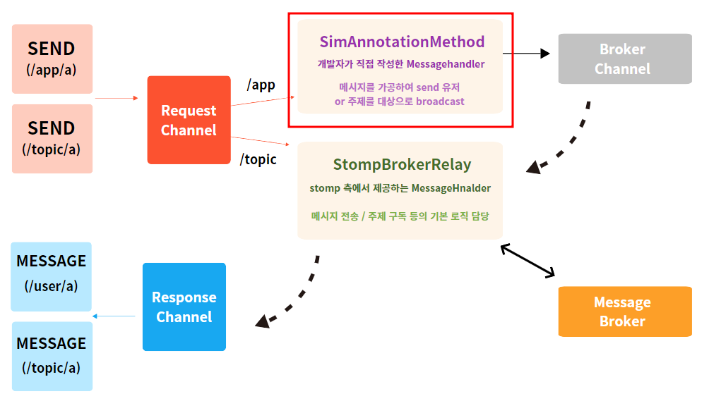

# 실시간 친구 도착 예정정보 구현일지 feat) 폴링부터 웹 소켓까지

---

언제, 어디서, 무엇을 하든 지각하지 않게 도와주는 서비스 \`프로젝트 오디\`에서는
3차 스프린트 목표로 **실시간 친구 도착 여부를 알 수 있는 기능**을 핵심 기능으로 삼았다.


즉, 우리는 소비자에게 두 가지 기능을 제공해주고자 했다

> 1) 친구가 약속장소까지 몇 분정도 남았는지 알 수 있다  
> 2) 친구가 지각할지, 안 할지 물어보지 않아도 알 수 있다

이를 통해 친구들 사이에서 \`너 오디야?\`라고 묻는 상황을 최소화하고 만약 지각하는 친구가 있더라도 이를 유쾌하게 풀어낼 수 있는 서비스를 기획했다.

그럼 서비스 정책 기획부터 구현, 리팩터링까지 현재의 코드로 변하기 까지 어떤 과정을 거쳤는지 정리해보자

---

## **1\. 서비스 정책 및 구현 방식 정하기**

우선 제한 사항을 살펴보자

> \- API 사용량 : 대중교통 정보가 반영된 소요시간 측정은 일 1000건으로 한정되어 있다  
> \- 위치 공유 허용 여부 : 기기 사용자가 위치정보 공유에 동의하지 않을 수 있다  
> \- 화면 동기화 : 약속 참여자들이 동시에 같은 도착 예정 정보를 보아야 한다.

이 3가지 제한 사항을 고려해 몇가지 서비스 정책과 큰 구현 흐름이 정해졌다.

#### **1) 폴링 활용**

\- 약속 정보 화면 동기화를 위해 **약속 30분 전부터 10초 간격으로 도착 정보를 요청하는 폴링**이 시작된다 


즉, 약속이 2시라면 **약속 30분 전인 오후 1시 30분 부터 약속 참여원들은 본인들의 위치 정보를 10초 간격으로 보내준다.**


서버는 보내준 클라이언트의 위치 정보를 바탕으로 **클라이언트의 상태를 갱신**한다.

이렇듯 **일정한 주기를 가지고 클라이언트가 서버에 요청을 보내 응답값을 갱신하는 방식**을 폴링이라고 한다. 매번 커넥션을 연결해야 하고, 로직상 클라이언트가 호출 예약을 해야 하기 때문에 부담이 되지만 가장 간단한 방식으로 실시간성 정보 제공을 흉내낼 수 있는 방식이다.

---

#### **2) 도착 예정 시간 측정**


- API 호출 건수 절약을 위해 **10분 간격으로 현재 위치로부터 약속 장소까지의 대중교통 소요시간을 갱신**한다


- 10분이 지났다면 : API를 호출하여 현재위치로부터 대중교통 소요시간을 계산하여 반환한다

- 10분이 지나지 않았다면: 남은 시간에서 최근 호출 시간까지의 간격을 카운트 다운한 시간을 반환한다.

ex) 2분전에 갱신된 소요시간이 10분이라면 8분이 남았다고 반환한다.

#### **3) 도착 기준** 


- 약속 장소까지의 위경도 **직선거리가 300m 반경 안으로 들어오면 도착**으로 취급한다

---

#### **4) 상태 정의**

**4-1) 약속 시간 전**

\- 지각 위기 : 약속 시간 내에 도착할 수 없는 상태

\- 도착 예정 : 약속 시간 내에 도착가능한 상태

\- 도착 : 약속 장소 반경 300m 이내로 들어온 상태

\- 행방불명 : 위치 정보를 허용하지 않은 상태

**4-2) 약속 시간 후**

\- 지각 : 약속 장소에 도착하지 않은 상태

\- 도착 : 약속 장소 반경 300m 이내로 들어온 상태

\- 행방불명 : 위치 정보를 허용하지 않은 상태

---

## **2\. 로직 구현**

먼저 구현 과정을 이해하기 전에 우리 팀의 도메인 객체들을 설명하면 다음과 같다.


Meeting : 약속

Mate : 약속에 참여하는 모임원

ETA : 약속 모임원의 도착 예정 정보

Member : 회원 정보

이를 반영한 프로젝트의 ERD는 다음과 같다.


---

#### **2-1) API 확정하기**

먼저 안드로이드 측과 협의하여 API를 확정하였다

약속 참여원인 mate에 대한 도착정보 목록 요청이기 떄문에 **POST /v1/meetings/{meetingId}/mates/etas**로 api를 정했다

안드로이드에서는 다음 정보를 담아 요청을 준다.

**RequestBody**

| **이름** | **타입** | **설명** | **필수** |
| --- | --- | --- | --- |
| isMissing | Boolean | 위치추적 불가 여부 | O |
| currentLatitude | String | 현재 위도 | X |
| currentLongitude | String | 현재 경도 | X |

위경도 좌표는 디바이스에서 사용자가 위치정보 접근 허용권한을 꺼놓았을 수도 있으므로 null값을 허용했다.

**ResponseBody**

| **이름** |   | **타입** | **설명** |  | **필수** |
| --- | --- | --- | --- | --- | --- |
| ownerNickname |   | String | 기기 사용자 닉네임 |   |   |
| mateEtas |   | List<MateEtaResponse> | 참여자 도착 정보 리스트 |   | O |
|   | nickname | String | 참여자 닉네임 |   | O |
|   | status | String | 참여자 ETA 상태 | 지각 위기: LATE\_WARNING   도착 예정: ARRIVAL\_SOON   도착: ARRIVED   지각: LATE   추적 불가: MISSING | O |
|   | durationMinutes | Long | 도착지까지 남은 시간 |   | O |

**ex1) 약속 시간 전**

**: LATE\_WARNING(지각 위기) : 약속 시간까지 도착 못할 예정**

**: ARRIVAL\_SOON(도착 예정) : 약속 시간까지는 도착 가능함**

**: ARRIVED(도착)**

**: MISSING (행방불명) : 위치정보를 추적하지 못함**

```
{
  "ownerNickname" : "카키공주",
	"mateEtas": [
		{
			"nickname": "콜리",
			"status": "LATE_WARNING",
			"durationMinutes": 83
		},
		{
			"nickname": "올리브",
			"status": "ARRIVAL_SOON",
			"durationMinutes": 10
		},
		{
			"nickname": "해음",
			"status": "ARRIVED",
			"durationMinutes": 0
		},
		{
			"nickname": "카키공주",
			"status": "MISSING",
			"durationMinutes": -1
		}
	]
}
```

**ex2) 약속 시간 후 : LATE - ARRIVED 로 도착 여부를 판정하게 된다**

```
{
  "ownerNickname" : "카키공주",
	"mateEtas": [
		{
			"nickname": "콜리",
			"status": "LATE"
			"durationMinutes": 30
		},
		{
			"nickname": "올리브",
			"status": "ARRIVED"
			"durationMinutes": 0
		},
		{
			"nickname": "해음",
			"status": "ARRIVED"
			"durationMinutes": 0
		},
		{
			"nickname": "카키공주",
			"status": "MISSING"
			"durationMinutes": -1
		}
	]
}
```

이렇게 API에 대한 전반적인 내용을 확정하고 페어인 카키와 함께 로직 구현에 들어갔다.

---

#### **2-2) 로직 구현하기**

먼저 코드 작성에 들어가기 전에 상태 판단 알고리즘의 전반적인 흐름을 화이트보드에 쭉 정리해보았다.


이를 순서도로 다시 도식화하면 다음과 같다.


로직이 복잡한 만큼 bottom-up 방식으로 구현해보기로 했다.

---

**1) 하위 모듈 만들기 : DistanceCalculator**

먼저 두 위 경도 좌표 간에 직선 거리를 계산하는 DistanceCalculator를 만들었다.


공식은 하버사인 공식을 사용했다.

```
@NoArgsConstructor(access = AccessLevel.PRIVATE)
public class DistanceCalculator {

    public static double calculate(Coordinates origin, Coordinates target) {
        ...// 하버사인 공식을 활용하여 직선 거리 계산
    }
```

2**) 도착 예정정보 판단 로직 작성하기**

다음으로 EtaStatus를 상황에 따라 반환하는 로직을 작성해주었다.


```
public enum EtaStatus {
    ARRIVED,
    ARRIVAL_SOON,
    LATE_WARNING,
    LATE,
    MISSING,
    ;

    public static EtaStatus from(Eta mateEta, LocalDateTime meetingTime, LocalDateTime now, boolean isMissing) {
        // 행방불명이면 missing 반환
        if (isMissing) {
            return MISSING;
        }
        
        // 도착예정정보가 도착상태라면 arrived
        if (mateEta.isArrived()) {
            return ARRIVED;
        }
        
        // 약속 시간에 늦지 않을 예정이고 아직 약속 시간이 지나지 않았다면 arrival soon
        if (!mateEta.willBeLate(meetingTime) && (now.isBefore(meetingTime))) {
            return ARRIVAL_SOON;
        }
        
        if (mateEta.willBeLate(meetingTime)) {
            //약속 시간에 늦을 예정이고 아직 약속 시간 이전이라면 late_warning
            if (now.isBefore(meetingTime)) {
                return LATE_WARNING;
            }
            
            //이미 약속 시간에 늦었다면 late
            return LATE;
        }

        throw new OdyServerErrorException("참여자의 ETA 상태를 판단할 수 없습니다");
    }
}
```

**3) 서비스 정책에 따른 조건식을 private method로 만들어주기**

**\-- 도착 정보를 판단하는 로직 : 위경도 직선거리가 300m이내 + 약속시간 전이라면 => 도착**


```
     private boolean determineArrived(MateEtaRequest mateEtaRequest, Meeting meeting, LocalDateTime now) {
        LocalDateTime meetingTime = meeting.getMeetingTime().withSecond(0).withNano(0);
        double distance = DistanceCalculator.calculate(
                Double.valueOf(mateEtaRequest.currentLatitude()),
                Double.valueOf(mateEtaRequest.currentLongitude()),
                Double.valueOf(meeting.getTarget().getLatitude()),
                Double.valueOf(meeting.getTarget().getLongitude())
        );
        return distance <= ARRIVED_THRESHOLD_METER && (now.isBefore(meetingTime) || now.isEqual(meetingTime));
    }
```

**\-- API를 호출해야 하는지 판단하는 로직 : 최초호출이거나, api를 호출한지 10분이 지났다면 호출해야 한다.**


```
    private boolean isOdysayCallTime(Eta mateEta) {
        return !mateEta.isModified() || mateEta.differenceMinutesFromLastUpdated() >= ODSAY_CALL_CYCLE_MINUTES;
    }
```

**4) EtaService 구현하기**

위에서 구현한 내용을 합쳐  service 단에서 로직을 모두 드러나게 나열하는 식으로 우선 코드를 짰다.

(지금 보아도 부끄러운 코드다....)

```
    @Transactional
    public MateEtaResponses findAllMateEtas(MateEtaRequest mateEtaRequest, Long meetingId, Member member) {
        //먼저 위치를 보내준 약속 참여원을 가져온다
        Mate requestMate = findByMeetingIdAndMemberId(meetingId, member.getId());
        Meeting meeting = requestMate.getMeeting(); //약속
        LocalDateTime meetingTime = meeting.getMeetingTime().withSecond(0).withNano(0); //약속시간
        Eta mateEta = findByMateId(requestMate.getId()); //참여원의 도착예정 정보
        LocalDateTime now = LocalDateTime.now().withSecond(0).withNano(0); //현재 시간

        //도착했다면 ETA를 도착상태로 업데이트한다
        if (determineArrived(mateEtaRequest, meeting, now)) {
            mateEta.updateArrived();
        }
        
        // 도착하지 않고 api를 호출해야 한다면(호출한지 10분이 지났다면) 호출하여 시간을 업데이트한다
        if (!mateEta.isArrived() && isOdysayCallTime(mateEta)) {
            RouteTime routeTime = routeService.calculateRouteTime(requestMate.getOrigin(), meeting.getTarget());
            mateEta.updateRemainingMinutes(routeTime.getMinutes());
        }
        
        //약속참여원들의 ETA를 매핑하여 전달한다
        List<MateEtaResponse> mateEtaResponses = etaRepository.findAllByMeetingId(meetingId).stream()
                .map(eta -> MateEtaResponse.of(eta, mateEtaRequest.isMissing(), meetingTime, now))
                .toList();
        return new MateEtaResponses(requestMate.getNicknameValue(), mateEtaResponses);
    }
}
```

동작은 했다. 그런데 진짜 동작만 했고 여러 부분에서 굉장히 심기가 불편했다. OOP 스럽지 않았다. 메서드가 10줄을 넘었다. 마치 알고리즘을 풀듯이 절차지향적으로 코드를 짠 느낌이 들었다.

---

#### **2-3) 무엇이 불편했을까?**

**첫째, 중복 코드가 많았다.** 

\- 시간 선후관계 판단에서 나노초를 제거하는 코드 : withNano(0)

\- 약속 시간이 지났는지 판단하는 코드 : (now.isBefore(meetingTime) || now.isEqual(meetingTime));

**둘째, 메서드 하나에 너무 많은 책임이 들어있었다**

\- 메서드 1개가 10줄이 넘었다.

\- Eta를 매핑할 때(Eta.from), 파라미터가 4개에 달했다. 

\- findAllMateEtas라는 메서드 명은 단지 쿼리형 메서드의 느낌을 준다. 실제로는 eta의 상태가 변경된다. 

**셋째, 시키지 않고 물어보는 코드가 많았다.**

```
    @Transactional
    public MateEtaResponses findAllMateEtas(MateEtaRequest mateEtaRequest, Long meetingId, Member member) {
        //먼저 위치를 보내준 약속 참여원을 가져온다
        Mate requestMate = findByMeetingIdAndMemberId(meetingId, member.getId());
        Meeting meeting = requestMate.getMeeting(); //약속
        LocalDateTime meetingTime = meeting.getMeetingTime().withSecond(0).withNano(0); //약속시간
        Eta mateEta = findByMateId(requestMate.getId()); //참여원의 도착예정 정보
        LocalDateTime now = LocalDateTime.now().withSecond(0).withNano(0); //현재 시간
        .....
```

\- **묻지말고 시켜라! 원칙에 어긋나는 코드**가 많았다.

\- 절차지향적으로 필요한 데이터를 메서드 초반에 나열하고, 이를 활용하는 식으로 로직을 짰다

---

## **3\. 리팩터링 하기**

결과적으로 마감기한에 쫓겨 OOP 스럽지 못한 코드를 짜내었다. 그래서 페어인 카키에게 리팩터링을 제안했고 너무나 고맙게도 11시 이후에 새벽까지 24시간 카페에 가서 몇 시간 더 리팩터링을 함께 할 수 있었다.

#### **리팩터링1. 중복 코드 > 객체에게 책임 부여**

중복되는 로직을 객체가 처리할 수 있도록 크로스 커팅해주었다.

**\- 중복코드1 : 시간 선후관계 판단에서 나노초를 제거하는 코드 : withNano(0)**

TimeUtil 객체를 만들어 나노초 trim 작업을 담당하게 하였다.

```
public class TimeUtil {

    public static LocalDateTime trimSecondsAndNanos(LocalDateTime time) {
        return time.withSecond(ROUND_DIGITS)
                .withNano(ROUND_DIGITS);
    }
}
```

**\- 중복 코드2 : 약속 시간이 지났는지 판단하는 코드 : (now.isBefore(meetingTime) || now.isEqual(meetingTime));**

meeting에게 약속이 끝났는지 물어보게 하였다

```
public class Meeting extends BaseEntity { 
    ...

    //약속에게 물어본다 : 너 끝난 약속이니?
    public boolean isEnd() {
        return TimeUtil.nowWithTrim().isAfter(getMeetingTime());
    }

    public LocalDateTime getMeetingTime() {
        return TimeUtil.trimSecondsAndNanos(LocalDateTime.of(date, time));
    }
}
```

카운트 다운 한 소요시간(최근 API 호출시간으로부터의 간격을 소요시간으로부터 뺀 시간)을 기준으로 시간 내에 도착할 수 있을 것 같은지에 대한 판단도 **도착 예정정보인 ETA에게 물어보도록 리팩터링**하였다

```
public class Eta {
   .... 중략 ...

    public long countDownMinutes() {
        LocalDateTime now = TimeUtil.nowWithTrim();
        long minutesDifference = Duration.between(updatedAt, now).toMinutes();
        return Math.max(remainingMinutes - minutesDifference, 0);
    }

    public boolean isArrivalSoon(Meeting meeting) {
        LocalDateTime now = TimeUtil.nowWithTrim();
        LocalDateTime eta = now.plusMinutes(countDownMinutes());
        return (eta.isBefore(meeting.getMeetingTime()) || eta.isEqual(meeting.getMeetingTime())) && !isArrived;
    }
}
```

그 결과 EtaStatus에서 매핑하는 로직이 정말 깔끔하게 빠질 수 있었다.

```
public enum EtaStatus {

    MISSING((eta, meeting) -> eta.isMissing()),
    ARRIVED((eta, meeting) -> eta.isArrived()),
    ARRIVAL_SOON((eta, meeting) -> eta.isArrivalSoon(meeting) && !meeting.isEnd()),
    LATE_WARNING((eta, meeting) -> !eta.isArrivalSoon(meeting) && !meeting.isEnd()),
    LATE((eta, meeting) -> !eta.isArrivalSoon(meeting) && meeting.isEnd()),
    ;

    private final BiPredicate<Eta, Meeting> condition;

    EtaStatus(BiPredicate<Eta, Meeting> condition) {
        this.condition = condition;
    }

    public static EtaStatus of(Eta mateEta, Meeting meeting) {
        return Arrays.stream(values())
                .filter(status -> status.condition.test(mateEta, meeting))
                .findFirst()
                .orElseThrow(() -> new OdyServerErrorException("참여자의 ETA 상태를 판단할 수 없습니다"));
    }
}
```

---

#### **리팩터링2. 두꺼운 메서드 > 메서드 분리**

**순서도를 보면 흐름이 크게 2가지로 나뉘었다.**


**\- 1. 위치를 보내준 디바이스 사용자의 ETA 상태 업데이트**

**\- 2. 모임 참여원들의 ETA 조회**

두 메서드를 private method로 분리하여 쿼리용 메서드와 명령형 메서드를 분리해주었다.

```
    @Transactional
    public MateEtaResponsesV2 findAllMateEtas(MateEtaRequest mateEtaRequest, Mate mate) {
        .....중략...
        
        //1. 나의 ETA 상태 업데이트
        updateMateEta(mateEtaRequest, mateEta, meeting);
        
        //2. 내가 속한 모임원들의 ETA 조회
        return etaRepository.findAllByMeetingId(meeting.getId()).stream()
                .map(eta -> MateEtaResponseV2.of(eta, meeting))
                .collect(Collectors.collectingAndThen(
                        Collectors.toList(),
                        mateEtas -> new MateEtaResponsesV2(mate.getId(), mateEtas)
                ));
    }
```

이렇게 리팩터링을 마친 상태로 3차 스프린트 데모데이를 마주했었다. 나름 기능도 정상동작했고 급한대로 조금은 코드의 악취를 덜어낸 것 같았다. 그렇게 행복한 상태로 마주할 줄 알았던 데모데이날, 무언가 잘못된 걸 발견하기 전까지...

---

## **4\. 안드로이드의 스케쥴링 오버 문제**

데모데이 날 테스트를 위해 몇 가지 약속을 만들던 중 약속이 많아지면 ETA 상태 api를 안드로이드가 호출하지 않는 문제를 발견했다. 


우리는 폴링을 통해 정보의 실시간 성을 보장하려 했기에 안드로이드 측에서 동적으로 api 호출을 예약하는 과정이 필요했다. 따라서 약속을 만들고 참여하는 순간 기기 사용자 휴대폰에서 약속 30분 전부터 10초 간격으로 api 호출을 예약했다. 즉 약속 하나당 기기가 180건의 api 호출을 하도록 스케쥴링을 해놓은 것이다.


그런데 test 용 약속을 많이 만들기 시작하면서 한 기기에서 예약 가능한 큐가 가득찼고 그 결과 몇가지 예약이 씹히기 시작했다. 기기에서 예약가능한 건수를 넘어서 예약을 하기 시작하니 요청을 해야 서버에서 응답을 줄 수 있는데 요청 자체를 하지 않아 약속 참여원들이 보는 화면이 달라지거나 업데이트가 느려지는 등, 실시간 도착 예정 정보 공유라고 볼 수 없는 상황들이 발생하기 시작한 것이다.

그래서 안드로이드 측과 협의해 방법을 찾고자 하였고, 웹 소켓으로의 전환을 생각해내었다.

---

## **5\. 웹 소켓으로의 전환**

문제의 원인은 안드로이드가 과도한 스케쥴링 부담을 질 수 없다는 것이었다. 그럼 해결책은?

> \- 1. 업데이트 간격인 10초를 더 늘려서 부담을 줄인다.  
> \- 2. 안드로이드가 한번에 180개가 아니라 동적으로 스케쥴링을 하도록 로직을 고친다  
> \- 3. 스케쥴링 부담을 서버로 이전한다.

첫번째 대안은 유저 경험 상 10초 이상의 간격이 부자연스러울 것 같다는 데 의견이 맞추어졌다.

두번째 대안은 시도해보았으나 어느 정도 임시책에 불가할 뿐, 결국 한 사람이 생성하는 약속이 많아진다면 똑같은 문제가 발생할 위험이 있었다.

따라서 **우선 2번 대안을 시도해보고 3번 대안으로 장기적인 리팩터링을 시도하는 방향**으로 의견이 모아졌다.

그리고 그 3번 대안이 바로 웹 소켓 + STOMP를 이용한 통신이었다.

그럼 어떤 사고과정을 통해 웹 소켓이라는 해결책을 떠올렸는지 바라보자

#### **5-1) 웹 소켓이 왜 HTTP의 단점을 극복할 수 있는가?**


앞선 polling 방식의 통신에서는 요청에 대한 책임을 온전히 client가 지고 있었다. 따라서 server는 단순히 요청에 응답을 하는 주체로서의 역할만을 담당했다. 이는 요청이 오지 않으면 서버가 할 수 있는 일은 아무것도 없다는 걸 의미한다.

그러나 웹소켓은 **양방향 통신이 가능**하다


즉, 클라이언트가 한번 웹소켓 프로토콜로 전환을 요구한 이후, 커넥션을 계속 들고 있으면서 연결이 끊어질 때까지 양방향 통신을 가능하게 한다. 바로 이러한 웹소케스이 양방향성이 우리 팀이 안드로이드 측의 요청 부담을 서버로 이전할 수 있다고 생각했던 부분이었다.

---

#### **5-2) STOMP 도입 결정**

이렇게 웹 소켓을 도입하기로 결정하고 페어인 조조와 협의하던 중 메시지 전송에 특화되어 있는 STOMP가 웹소켓 + SpringBoot 환경일 때 굉장히 강력하다는 사실을 알게 되었다.

이번 글에서는 Stomp의 자세한 내용보다 문제를 해결해 나아가는 과정을 이해할 정도의 간단한 지식들만 서술해보려 한다.

#### **1) Stomp는 Frame 기반으로 소통한다.**

RFC2616을 기반으로 Http의 통신에서 주고받는 데이터를 살펴보면 대게 다음과 같다.


Stomp도 Http를 기반으로 모델링되었기 때문에 비슷한 데이터 형식을 주고 받는다. 그러나, Http에 있는 모든 정보를 주고 받기에는 너무 무거워 **Frame이라는 단위로 소통**하게 된다.

Fame은 이렇게 생겼다.

> COMMAND  
> header1:value1  
> header2:value2
>
> Body^@

클라이언트는 SEND, SUBSCRIBE 등의 메시지 명령을 COMMAND에 담는다.

그리고 어디로 보낼 것인가?(destination) 등의 부가 정보를 header에 담는다.

이외의 메시지는 body에 담아 보내준다.

#### **2) Stomp는 Pub/Sub 구조를 기반으로 한 메시지 소통이 가능하다**

Pub/Sub 구조는 우리가 유투브에서 보는 구조 그 자체이다.

컨텐츠를 발행하는 Publisher가 있고, 그 컨텐츠를 구독하는 Subscriber가 있다.

이를 기반으로 메시지 전달 과정을 설명하면 다음과 같다.

각 Subscriber가 다음과 같은 구독을 했다고 가정해보자


각 Publisher는 Broadcasting을 할 수 있는데 이는 **특정 채널을 구독한 모든 Subscriber에게 메시지를 전달하는 것**을 의미한다. 예를 들어 위의 예시에서 각 Publisher가 메시지를 Broadcasting을 한다고 가정한다면


Publisher1을 구독한 Subscriber1과 Subscriber2는 BRO라는 메시지를 전달받게 되고,

Publisher2를 구독한 Subscriber2와 Subscriber3는 CCOLI라는 메시지를 전달받게 되는 것이다.

STOMP가 WebSocket을 기반으로 함께 운용될 때 강력한 이유는 위의 Pub/Sub 구조와도 연관이 있다. BroadCasting 과정에서 구독을 한 Subscriber는 본인들이 요청을 하지 않았음에도 Message를 전달받게 된다. 즉 양방향 통신의 이점을 잘 살려 실시간 정보 교환을 보장하는 구조이다.

#### **3) Stomp는 Spring Boot의 Controller를 endpoint로 로직 설계가 가능하다**

Stomp를 Spring Boot와 함께 쓰면 좋은 점은 기존 controller의 구조를 거의 그대로 유지하면서 메시지 처리 로직을 수행할 수 있기 때문이다.

그럼 어떻게 그러한 구조가 가능할까? 이는 STOMP의 기본 통신 방식을 이해하면 가능하다


여러 메시지 요청이 오면 Requset Channel은 endpoint에 따라 메시지를 전달할 MessageHandler를 탐색한다. 여기서 개발자는 설정에 따라 endpoint를 나눌 수 있다. **여기서 endpoint를 나눈다는 것은 우리가 작성한 MessageHandler에게 전달할 api prefix와 Stomp에서 기본적으로 주어지는 MessageHandler에게 처리를 위임할 api prefix를 나눈다**는 의미와도 동일하다. 

즉, 위의 예시에서는 /app으로 요청이 오면 우리가 직접 작성한 MessageHandler에게 처리를 라우팅하고, /topic으로 시작하는 api 요청이 오면 바로 stomp에서 제공하는 StompBrokerRelay로 처리를 위임한다는 것을 의미한다.

그러면 Stomp 프로토콜에서 개발자가 개발해주어야 할 부분은 어디로 한정될까?



맞다. /app으로 요청이 왔을 때 endpoint가 되는 controller만 구현해주면 사실 상 기존 spring에서 사용하는 layered architecture와 전혀 다를 바 없는 구조에서 웹 소켓 로직을 처리할 수 있게 되는 것이다.

이를 위한 설정도 간단하다.

공식문서를 기반으로 따라가보면 

\- 먼저 기존 messagehandler와 우리가 정의한 messagehandler를 나눌 endpoint를 설정한다.

```
@Configuration
@EnableWebSocketMessageBroker
public class WebSocketConfig implements WebSocketMessageBrokerConfigurer {

	@Override
	public void registerStompEndpoints(StompEndpointRegistry registry) {
		registry.addEndpoint("/portfolio"); 
	}

	@Override
	public void configureMessageBroker(MessageBrokerRegistry config) {
		config.setApplicationDestinationPrefixes("/app"); 
		config.enableSimpleBroker("/topic", "/queue"); 
	}
}
```

여기서 enalbeSimpleBroker에 설정한 "/topic", 과 "/queue" 의 경우 구독이나 브로드 캐스팅 처럼 기존 simplebroker에게 바로 위임한다. 그와 달리 /app으로 시작되는 요청의 경우 @Controller 클래스에 @MessageMapping을 통해 구현한 MessageHandler를 통해 우리가 정의한 로직을 선수적으로 처리하도록 한다.

```
@Controller
public class GreetingController {

	@MessageMapping("/greeting")
	public String handle(String greeting) {
		return "[" + getTimestamp() + ": " + greeting;
	}
}
```

예를 들어 위와 같이 GreetingController가 정의되어 있다면 /app/greeting에 해당하는 요청에 대하 GreetingController의 handle을 endpoint로 message를 매핑할 수 있도록 한다.

그럼 메시지를 보내는 것은 어떻게 할까? @SendToUser를 통해 요청을 준 user session을 대상으로 하거나, @SendTo를 통해 특정 주제를 대상으로 broadcast 하는 것이 가능하다

```
@Controller
public class GreetingController {

    @MessageMapping("/greeting")
    @SendToUser("/queue/greeting", broadcast = false)
    public String handle(String greeting) {
        return "[" + getTimestamp() + ": " + greeting;
    }
    
    @MessageMapping("/greeting2")
    @SendTo("/topic/greeting2")
    public String handle2(String greeting) {
        return "[" + getTimestamp() + ": " + greeting;
    }
}
```

**\- @SendToUser(destination) : 요청을 보낸 user에게 응답**

위와 같은 controller에서 handle은 /app/greeting 이란 요청이 들어오면 타임스탬프에 대한 메시지를 /queue/greeting을 통해 요청을 보낸 user를 특정하여 메시지를 보낸다. broadcast 옵션을 켜면 /queue/greeting 이란 주제를 구독한 모든 user들에게 같은 메시지를 보낼 수 있다.
